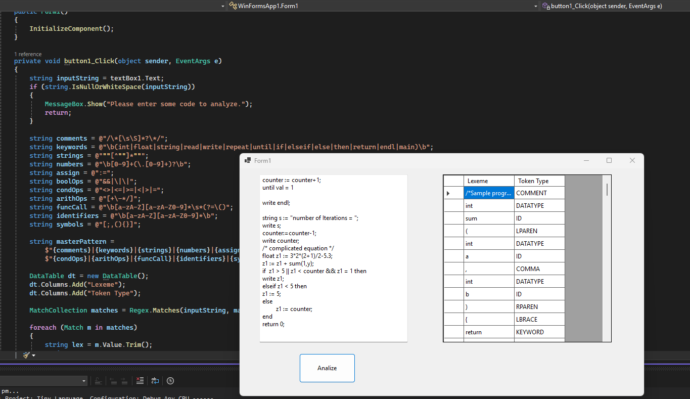
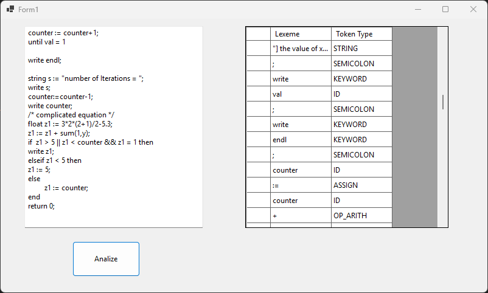

# Tiny Language Compiler – Lexical Analyzer (Task 1)

[](https://dotnet.microsoft.com)
[](https://dotnet.microsoft.com)

This is **Task 1** of the Compiler Construction course project.

## 📋 Project Description

The Tiny Language is a small programming language used for teaching compiler design.  
It supports:
- Variables (`int`, `float`, `string`)
- Functions (including `main`)
- Control structures (`if-elseif-else`, `repeat-until`)
- I/O (`read` / `write`)
- Comments, strings, arithmetic, conditions, etc.


## ✨ Features

- Recognizes all tokens from the official specification:
  - Keywords, Datatypes, Identifiers, Numbers (int + float), Strings
  - Comments (`/* ... */`)
  - Function calls (e.g. `sum(a, b)`, `rand()`)
  - Operators (`:=`, `+`, `-`, `*`, `/`, `<`, `>`, `=`, `<>`, `<=`, `>=`, `&&`, `||`)
  - Symbols (`;`, `,`, `(`, `)`, `{`, `}`)
- Clean GUI built with **Windows Forms**
- Results displayed in a DataGridView (Lexeme + Token Type)

## 🛠 Technologies Used

- C# (.NET Framework / .NET 8)
- Windows Forms (WinForms)
- `System.Text.RegularExpressions` (Regex-based lexer)
- DataTable + DataGridView

## 🚀 How to Run

1. Open the solution in **Visual Studio**
2. Press `F5` or click the Run button
3. Paste any Tiny Language code into the textbox
4. Click **"Analyze"**
5. See the tokens in the grid below

## 📄 Task 1 Deliverable

The **Regular Expression rules** used in this lexer are:

**1. Number**
```
[0-9]+(\.[0-9]+)?
```
Examples: `123`, `554`, `205`, `0.23`, `5.3`

---

**2. String**
```
"[^"]*"
```
Examples: `"Hello"`, `"2nd + 3rd"`, `"number of Iterations = "`

---

**3. Reserved Keywords**
```
int|float|string|read|write|repeat|until|if|elseif|else|then|return|endl|main
```

---

**4. Comment_Statement**
```
/\*[\s\S]*?\*/
```
Examples: `/*this is a comment*/`, `/* complicated equation */`, `/*input an integer*/`

---

**5. Identifier**
```
[a-zA-Z][a-zA-Z0-9]*
```
Examples: `x`, `val`, `counter1`, `str1`, `z1`, `fact`

---

**6. Function_Call**
```
[a-zA-Z][a-zA-Z0-9]*\s*(?=\()
```
Examples: `sum(a,b)`, `factorial(c)`, `rand()`  

---

**7. Assignment Operator**
```
:=
```

---

**8. Arithmetic_Operator**
```
[+\-*/]
```

---

**9. Condition_Operator**
```
<>|<=|>=|<|>|=
```

---

**10. Boolean_Operator**
```
&&|\|\|
```

---

**11. Symbols**

```
[;,(){}]
```

---

**12. Whitespace** *(ignored — not tokenized)*
```
[ \t\r\n]+
```

---

## 🏷 Token Types

| Token | Description |
|-------|-------------|
| `NUM` | Integer or float number |
| `STRING` | String literal |
| `DATATYPE` | `int`, `float`, `string` |
| `KEYWORD` | All other reserved keywords |
| `COMMENT` | Block comment `/* ... */` |
| `FUNC_CALL` | Function call identifier |
| `ID` | Identifier |
| `ASSIGN` | `:=` |
| `OP_ARITH` | `+` `-` `*` `/` |
| `OP_COND` | `<` `>` `=` `<>` `<=` `>=` |
| `OP_BOOL` | `&&` `\|\|` |
| `SEMICOLON` | `;` |
| `COMMA` | `,` |
| `LPAREN` | `(` |
| `RPAREN` | `)` |
| `LBRACE` | `{` |
| `RBRACE` | `}` |

## 📸 Screenshots




## 📌 Future Tasks

- Task 2: Syntax Analyzer (Parser + CFG)
- Task 3: Semantic Analyzer
- Task 4: Code Generation / Interpreter

## 📜 License

This project is licensed under the **MIT License** – see the [LICENSE](LICENSE) file for details.

---

**Made for Compiler Construction Course**  
Feel free to use this for learning (with proper credit 👍)