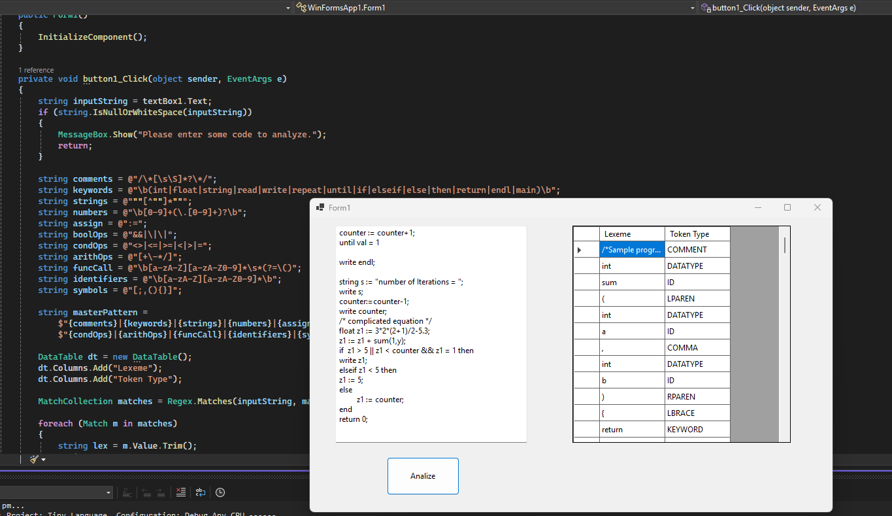
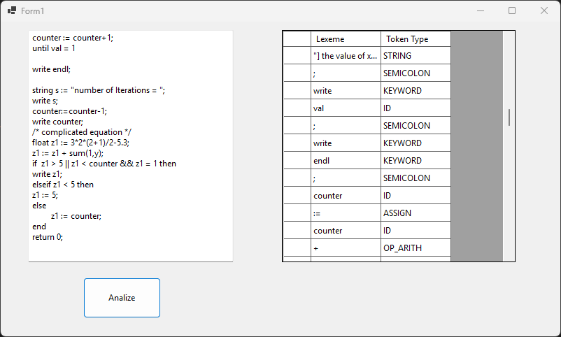
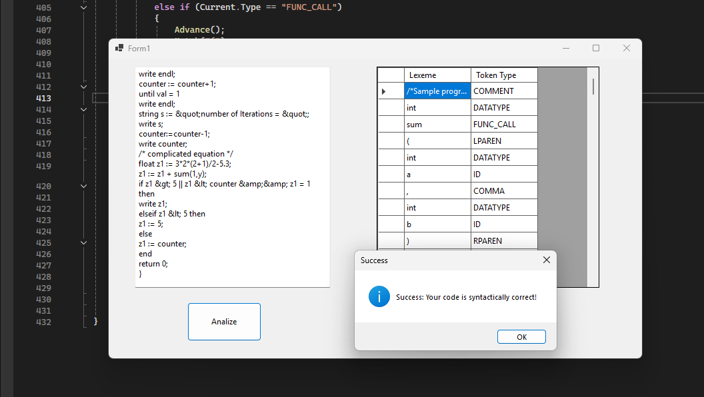

# Tiny Language Compiler – Lexical Analyzer (Task 1)

[](https://dotnet.microsoft.com)
[](https://dotnet.microsoft.com)


## 📋 Project Description

The Tiny Language is a small programming language used for teaching compiler design.  
It supports:
- Variables (`int`, `float`, `string`)  including multi-variable declarations (`int a, b;`)
- Functions definitions with typed parameters (`int sum(int a, int b) { ... }`) and calls
- Control structures (`if-elseif-else-end`, `repeat-until`)
- I/O (`read` / `write`) with or without parentheses
- Comments, strings, arithmetic, conditions, etc.

---

## 🚀 How to Run

1. Open the solution in **Visual Studio**
2. Press `F5`, paste Tiny Language code into the textbox, and click **"Analyze"**
3. Tokens appear in the grid; a popup reports success or a syntax error

---

## Phase 1 – Lexical Analysis

Regex-based scanner that tokenizes input into the types below.  

| Token | Description |
|-------|-------------|
| `DATATYPE` | `int`, `float`, `string` |
| `KEYWORD` | `if`, `then`, `else`, `elseif`, `end`, `repeat`, `until`, `read`, `write`, `return`, `endl`, `main` |
| `ID` | Identifier |
| `FUNC_CALL` | Function name before `(` |
| `NUM` | Integer or float |
| `STRING` | `"..."` literal |
| `ASSIGN` | `:=` |
| `OP_ARITH` | `+ - * /` |
| `OP_COND` | `< > = <> <= >=` |
| `OP_BOOL` | `&& \|\|` |
| `COMMENT` | `/* ... */` |
| `SEMICOLON / COMMA / LPAREN / RPAREN / LBRACE / RBRACE` | Punctuation |

---

## Phase 2 – Syntax Analysis

Recursive-descent parser validates the token stream. Key grammar rules:

```
Program     →  { FuncDef | Statement }
FuncDef     →  DATATYPE FUNC_CALL ( ParamList ) { Statements }
ParamList   →  ε | DATATYPE ID { , DATATYPE ID }
Declaration →  DATATYPE ID [ := Expr ] { , ID [ := Expr ] }
IfStmt      →  if [( ] Cond [ )] then Statements
               { elseif [( ] Cond [ )] then Statements }
               [ else Statements ] end
RepeatStmt  →  repeat Statements until [( ] Cond [ )]
WriteStmt   →  write endl | write [( ] Expr [ )]
ReadStmt    →  read [( ] ID [ )]
Expression  →  Term { (+|-) Term }
Term        →  Factor { (*|/) Factor }
Factor      →  ID | NUM | STRING | ( Expr ) | FUNC_CALL ( ArgList )
```

---


## 📸 Screenshots






## 📜 License

This project is licensed under the **MIT License** – see the [LICENSE](LICENSE) file for details.

---

**Made for Compiler Construction Course**  
Feel free to use this for learning (with proper credit 👍)